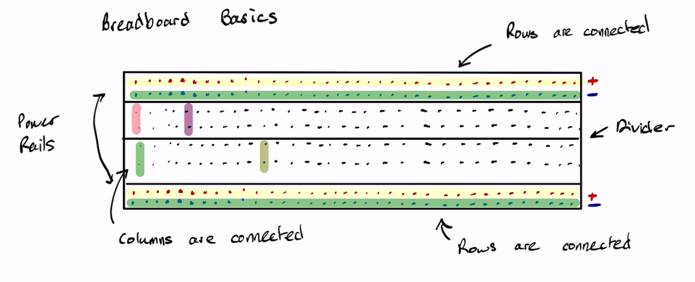
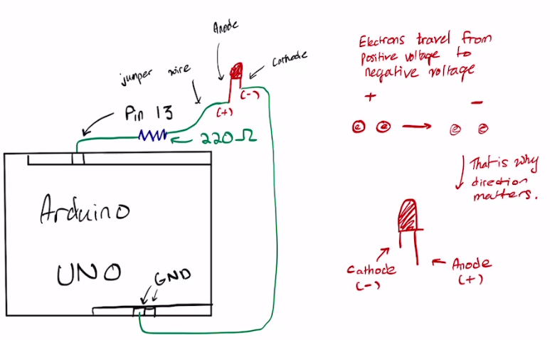

# Lesson 2 - Arduino Basics

**Our First Arduino Program:**

```c
void setup() {
  // Start the Serial communication at 9600 baud
  Serial.begin(9600);
  Serial.println("Enter something:");
}

void loop() {
  // Check if data is available on the Serial port
  if (Serial.available() > 0) {
    // Read the incoming byte
    char incomingByte = Serial.read();

    // Echo the received byte back to the Serial monitor
    Serial.print("You entered: ");
    Serial.println(incomingByte);
  }
}
```

**Breadboard Basics**




**Our Second Arduino Program:**

Setting up our Arduino according to this diagram:


Now we will create a simple LED circuit powered by the Arduino.

```c
int ledPin = 13; // "Hey computer, set the variable ledPin to the integer 13

void setup() { // One time loop
  pinMode(ledPin, OUTPUT); // "Hey computer, the variable ledPin, i would want you to know that it is an output."
  // In other words, pin 13 is pushing power to the LED.
  
  // Communication Input and Output -----------------------
  Serial.begin(9600); 
  while (!Serial); // Wait for serial connection
  Serial.println("Type 'on' or 'off' to control the LED.");
  // -------------------------------------------------------
}

void loop() { // Our while loop in python, goes on forever.
  if (Serial.available()) { // If communication is available, then...
    String input = Serial.readStringUntil('\n'); // We take the users input
    input.trim(); // Remove any whitespace or newline

    if (input == "on") {
      digitalWrite(ledPin, HIGH); // Turn on our LED
      Serial.println("LED is ON");
    } else if (input == "off") {
      digitalWrite(ledPin, LOW); // Turn off our LED
      Serial.println("LED is OFF");
    } else {
      Serial.println("Invalid command. Type 'on' or 'off'. Or else we will have to learn about history.");
    }
  }
} 
```

