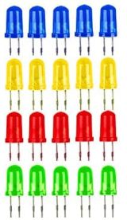
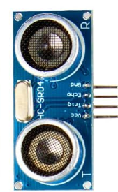
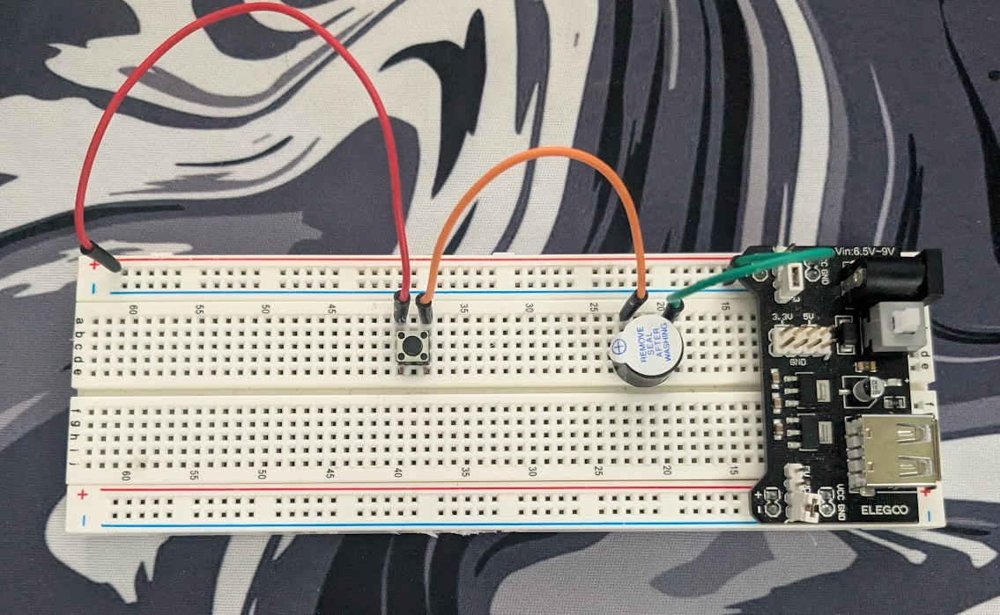

# Lesson 3 - Building a Burglar Alarm System

**Situation**: Let's say we want to leave our office to get some ice cream during our break. Five minutes after we left, a burglar tries to break into our office to steal our Arduino Uno. 

**Need**: To prevent this situation from happening what could we invent?

**Solution**: A Burglar Alarm System created with the usage of an Arduino.

**Burglar Alarm System**
- What do we need: 
    1. Something to make sound.
    2. Some sort of light to indicate
    3. Some sort of sensor to detect when a burglar enters.
    4. Authentication Method, either a card we tap or a pin we enter to say: "hey it's us"
    
- Parts:
    1. Buzzer (Remove Seal After Washing)
       
    2. LEDs
       
    3. HC-SR04 (SONAR/Ultrasonic Sensor)
       
    4. IR Remote Control (Numbers on it)
       
    
    

**Buzzer** - Day 1

- How does it work:
  
  - You've created this circuit. This circuit allows for a buzzer to be played when pressing the button. This button allows voltage to be passed through the buzzer and create a high pitched sound. 
